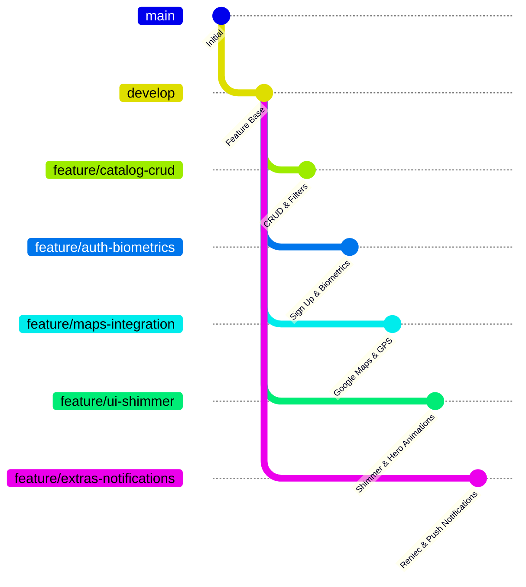

# 📋 Plan de Desarrollo del Proyecto Final - Comercializadora Aly

Este documento detalla el plan estratégico para finalizar el desarrollo de la aplicación móvil de **Comercializadora Aly**, optimizando el puntaje según la rúbrica de evaluación del docente y organizando el trabajo colaborativo para un equipo de **5 integrantes**.

---

## 🎯 Rúbrica de Evaluación y Estado del Proyecto

A continuación se detalla qué se ha implementado hasta el momento (Avance) y qué tareas están pendientes para garantizar los puntos máximos:

| Criterio | Puntaje | Estado de Avance Actual | Pendiente para Puntaje Máximo |
| :--- | :---: | :--- | :--- |
| **Catálogo** | 4 pts | Listado/Cuadrícula, buscador, agregar al carrito, subida de imágenes a Google Drive desde móvil (Middleware). | CRUD Completo para Administrador (Editar y Eliminar productos de Firestore), filtros avanzados por marca/precio/stock. |
| **Autenticación** | 3 pts | Inicio de sesión con Firebase Auth, auto-login con `SharedPreferences`, redirección según rol (Admin, Operador, etc.). | Registro de nuevo usuario (Sign Up), recuperación de contraseña y soporte para cierre definitivo de sesión. |
| **Geolocalización** | 4 pts | Cliente API Directions configurado (`GeolocalizacionService`) y almacenamiento en Firestore (`geolocalizacion_rutas`). | **Pantalla de Mapa Interactivo** usando `google_maps_flutter`, detección del GPS del usuario y trazado de rutas tienda ⇄ cliente. |
| **UI/UX** | 3 pts | Diseño oscuro premium industrial, micro-animaciones al agregar productos, pasarela 3D animada para tarjetas. | Shimmer effect (efecto esqueleto de carga), animaciones Hero entre pantallas, feedback háptico y transiciones suaves. |
| **Ideas Extras** | 2 pts | Estructura básica de modelos (DNI, Rutas) y servicios (`ReniecService`). | **1. Consulta Reniec (DNI)** para auto-llenado en registro.  **2. Login Biométrico** (Huella/FaceID).  **3. Notificaciones Locales** de pedidos. |
| **Total** | **16 pts** | *Avance base completado con éxito.* | *En desarrollo mediante la distribución de tareas.* |

---

## 💡 Ideas Extras Propuestas para los 2 Puntos Adicionales

Para asegurar los **2 puntos extras** de la rúbrica, implementaremos tres características avanzadas e innovadoras:

1. **Autenticación Biométrica (FaceID / Huella Digital)**:
   * **Implementación:** Usando el paquete `local_auth` (ya presente en `pubspec.yaml`). Permitirá a los usuarios iniciar sesión de manera segura y rápida con datos biométricos una vez que se hayan autenticado la primera vez.
2. **Registro de Usuarios con Validación de DNI (Reniec API)**:
   * **Implementación:** Integración del `ReniecService` en el formulario de registro. Al ingresar el DNI de 8 dígitos, el sistema consultará a la API de APIs Perú para recuperar y auto-completar el nombre y apellidos completos del cliente en tiempo real, garantizando datos limpios.
3. **Notificaciones Locales de Éxito de Compra**:
   * **Implementación:** Utilizando `flutter_local_notifications`. Al completar el flujo de pago de forma exitosa en la pasarela 3D, el sistema disparará una notificación push local de felicitación e información de procesamiento del pedido.

---

## 👥 Distribución del Trabajo para 5 Colaboradores

Para maximizar la eficiencia y mantener un flujo de trabajo ordenado bajo **GitFlow**, el proyecto se dividirá en ramas por cada integrante, realizando Pull Requests (PR) hacia la rama `develop`.

### 1. Colaborador 1 (Líder del Proyecto & Catálogo)
* **Rama Git:** `feature/catalog-crud`
* **Responsabilidades:**
  * Implementar las operaciones de **Edición** y **Eliminación** de productos desde el panel de administrador.
  * Añadir el panel de filtros avanzados en el catálogo (por rango de precios, marca, categoría y disponibilidad).
  * Crear advertencias de stock mínimo en la lista del catálogo.
* **Entregables / Commits principales:**
  * `feat(catalog): add delete and update product operations in Firestore`
  * `feat(catalog): add advanced filters sheet (price, brand, availability)`

### 2. Colaborador 2 (Especialista en Seguridad & Autenticación)
* **Rama Git:** `feature/auth-biometrics`
* **Responsabilidades:**
  * Diseñar la pantalla de **Registro de Nuevos Usuarios** (Sign Up).
  * Integrar **Autenticación Biométrica** (`local_auth`) en la pantalla de inicio de sesión (`LoginScreen`), permitiendo activar y usar huella/FaceID.
  * Desarrollar la pantalla de recuperación de contraseñas mediante Firebase Auth (`sendPasswordResetEmail`).
* **Entregables / Commits principales:**
  * `feat(auth): implement register screen linked with Firebase Auth`
  * `feat(auth): integrate biometric login (FaceID/Fingerprint) using local_auth`

### 3. Colaborador 3 (Diseñador UI/UX & Experiencia de Usuario)
* **Rama Git:** `feature/ui-shimmer`
* **Responsabilidades:**
  * Diseñar y aplicar el **Efecto Shimmer** (esqueleto animado de carga) en la lista de productos y dashboards mientras se consultan los datos de Firestore.
  * Integrar transiciones **Hero** entre la tarjeta del producto del catálogo y la pantalla de detalle del producto.
  * Configurar vibración y feedback háptico al añadir productos al carrito y procesar la compra.
* **Entregables / Commits principales:**
  * `style(ui): implement shimmer loading effect for product catalog`
  * `style(ux): add Hero transitions and haptic feedback on cart interactions`

### 4. Colaborador 4 (Desarrollador de Geolocalización & GPS)
* **Rama Git:** `feature/maps-integration`
* **Responsabilidades:**
  * Agregar la dependencia `google_maps_flutter` y `geolocator` al proyecto.
  * Crear la pantalla **`MapaRutaScreen`** para mostrar la ubicación de la tienda física de Comercializadora Aly.
  * Obtener la ubicación GPS en tiempo real del usuario móvil, calcular la distancia hacia la tienda llamando al `GeolocalizacionService` y dibujar la ruta poligonal en el mapa.
* **Entregables / Commits principales:**
  * `feat(maps): configure android/ios permissions and add google_maps_flutter`
  * `feat(maps): implement interactive route screen with real-time GPS coordinates`

### 5. Colaborador 5 (Desarrollador de Integraciones & Extras)
* **Rama Git:** `feature/extras-notifications`
* **Responsabilidades:**
  * Conectar el servicio `ReniecService` con la pantalla de registro para autocompletar nombres al ingresar el DNI.
  * Configurar e inicializar `flutter_local_notifications` para disparar una notificación local al realizar una compra exitosa.
  * Añadir un botón en la pantalla de recibo de compra para exportar los detalles del pedido en formato PDF simulado y permitir compartirlo mediante el plugin de Share.
* **Entregables / Commits principales:**
  * `feat(reniec): link DNI query with register form to auto-fill full name`
  * `feat(notifications): add push notification trigger on order completion`

---

## 🛠️ Plan de Verificación y Control de Calidad

1. **Pruebas Unitarias y Estáticas:**
   * Ejecutar de manera constante `flutter analyze` en la rama `develop` antes de realizar fusiones.
   * Evitar dependencias obsoletas e incompatibilidades de Gradle o CocoaPods al agregar los nuevos plugins de Mapas y LocalAuth.
2. **Validación en Dispositivos Reales (Android y iOS):**
   * El colaborador de Mapas verificará la concesión de permisos de ubicación tanto en Android (`AndroidManifest.xml`) como en iOS (`Info.plist`).
   * El colaborador de Autenticación verificará la activación biométrica en simuladores y dispositivos físicos para asegurar el correcto flujo de excepciones.
3. **Flujo de Firebase:**
   * Garantizar que los pedidos creados mantengan la consistencia en el esquema de colecciones Firestore `pedidos` para su correcta lectura en los dashboards de operador/inversionista.
